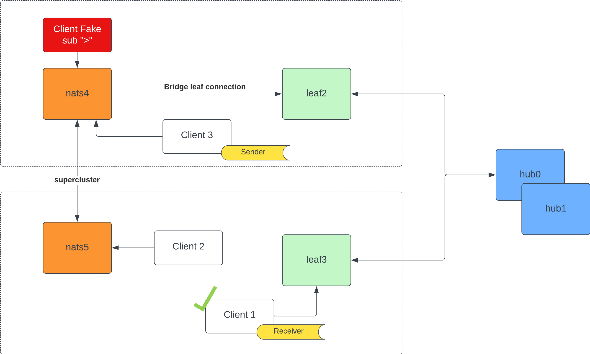
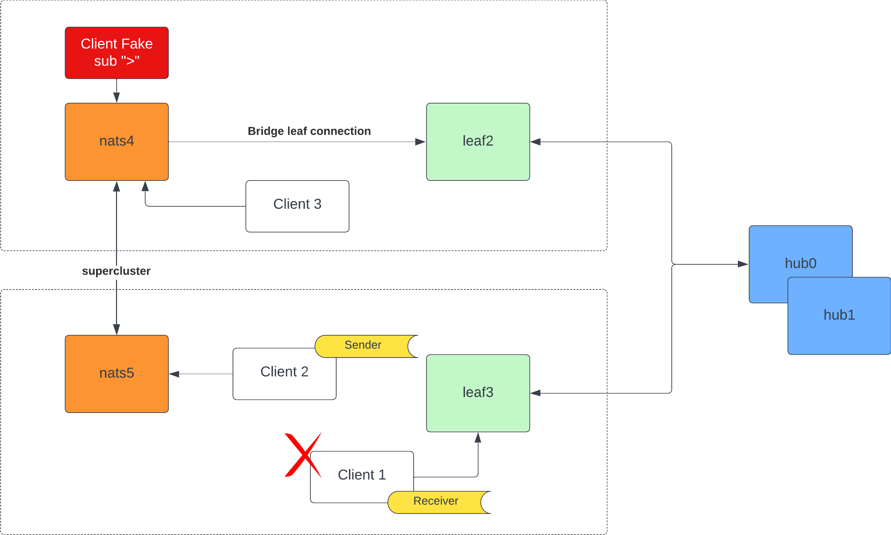
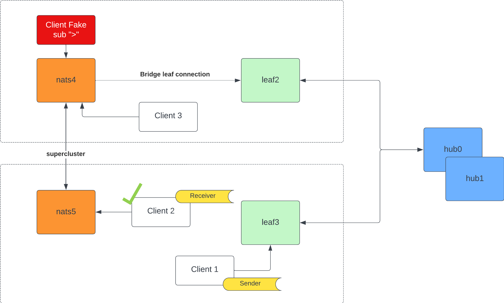

# Migration from Supercluster to Leaf/Hub Topology

This repository documents our migration strategy from a legacy supercluster topology to a new, more efficient leaf/hub topology for our messaging infrastructure. Our goal is to minimize client downtime and ensure a seamless transition for all services involved.

## Overview

The migration involves moving from a supercluster topology (legacy system) to a distributed leaf/hub topology.

### Legacy Supercluster Topology


The legacy system, depicted in orange, represents our initial supercluster setup.

### New Leaf/Hub Topology

The new topology, illustrated in green and blue, introduces a distributed architecture with leaf nodes (green) connected to hub nodes (blue).

## Migration Strategy

To ensure a smooth transition, we've implemented a bridge between a node in the supercluster and a leaf node in the new topology. This temporary measure allows for progressive migration without impacting client connectivity.

### Challenge Encountered

During the migration, we observed an issue with message delivery, particularly with interest propagation. Some messages were not being received by certain servers, affecting communication.

To address this, we introduced a temporary workaround: a dummy client that subscribes to all subjects, ensuring message flow continuity. This measure will remain in place until all clients have been successfully migrated.

## Request-Reply Scenario

We've identified a specific challenge with the request-reply messaging pattern:

### Scenario 1 :white_check_mark: Client 4 to Client 1 Request-Reply

Client 4 sending a request-reply to Client 1 works as expected.



**Commands to execute:**
```bash
nats --user og --password 'og' -s localhost:10041  sub '>'

nats --user o --password 'o' --trace -s localhost:10031 reply bob.hello "Message {{Count}} @ {{Time}}" --echo

nats --user og --password 'og' --trace -s localhost:10041 request bob.hello "Message: {{ Random 10 10 }}"
```

### Scenario 2 :x: Client 2 to Client 1 Request-Reply

Client 2 to Client 1 request-reply fails, with Client 1 not receiving the message.


**Commands to execute:**
```bash
nats --user og --password 'og' -s localhost:10041  sub '>'

nats --user o --password 'o' --trace -s localhost:10031 reply bob.hello "Message {{Count}} @ {{Time}}" --echo

nats --user og --password 'og' --trace -s localhost:10051 request bob.hello "Message: {{ Random 10 10 }}"
```

### Scenario 3 :white_check_mark: Client 1 to Client 2 Request-Reply

Client 1 to Client 2 request-reply functions correctly.


**Commands to execute:**
```bash
nats --user og --password 'og' -s localhost:10041  sub '>'

nats --user og --password 'og' --trace -s localhost:10051 reply bob.hello "Message {{Count}} @ {{Time}}" --echo

nats --user o --password 'o' --trace -s localhost:10031 request bob.hello "Message: {{ Random 10 10 }}"
```


### Troubleshooting Findings

For the problematic scenario where Client 2 sends a request-reply to Client 1, connecting a dummy client to `leaf3` that simply echoes messages revealed that messages do arrive at `leaf3`. This indicates a potential issue with interest propagation in the new topology.

